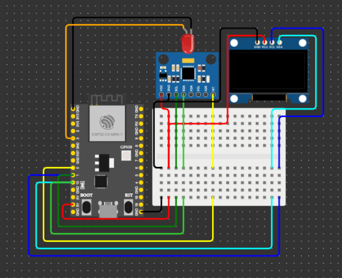
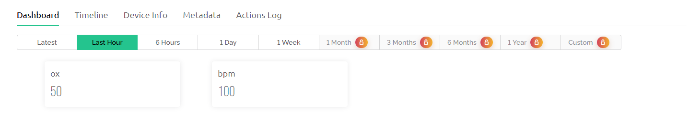

# Objetivo do projeto
Nosso projeto tem como objetivo principal facilitar o acompanhamento a distancia de psiquiatras e psicólogos, Por meio do sensoriamento remoto de informações do paciente como BPM e analise emocional de fotos do paciente, por meio destes visamos facilitar a identificação de quadros como depressão, ansiedade, insônia, dentre outros.

# Circuito

## plataforma
Para a criação do nosso circuito, nos utilizamos a plataforma Wokwi (Simulador)

Devido a algumas limitações da plataforma, nosso oximetro sera simulador pelo
componente MPU6050

## Componentes
#### - ESP32
#### - MPU6050 (Simulando oximetro)
#### - SSD1306 OLED display
#### - LED (simular batimento cardiaco)

## Codigo
```c++
// blynk
#define BLYNK_PRINT Serial
#define BLYNK_TEMPLATE_ID "TMPL2am1Pr9wW"
#define BLYNK_TEMPLATE_NAME "template"
#define BLYNK_AUTH_TOKEN "tr_o3U9hIj1UQV1s1LiYT9HwRga6FlxK"
/////////////////
byte bpmLed = 17;
byte tempoParaEnvioDeDados = 100;
/////////////////////////////////

#include <U8g2lib.h>
#include <Wire.h>
#include "MPU6050.h"
#include <WiFi.h>
#include <BlynkSimpleEsp32.h>


// oled
#define fontName u8g2_font_7x13_mf

U8G2_SSD1306_128X64_NONAME_1_HW_I2C u8g2(U8G2_R0, U8X8_PIN_NONE, 10, 1);

int16_t gyroX, gyroY, gyroZ;

// oxímetro de pulso (simulado pelo sensor MPU6050)
MPU6050 mpu;

byte bpm;
byte ox;

// wifi
WiFiClient cliente;

String apiKey = "H9N2VRLJG8UC09LW";
String request_str;

unsigned long tempo = 0;

//led
const byte led = 3; // led simulando batimentos cardíacos


void setup()
{
  Serial.begin(115200);
  while (!Serial)
    ;
  Serial.println("Serial inicializado.");

  // led (simulando visualmente a pulsação do coração)
  pinMode(3, OUTPUT);

  // iniciando wire lib
  if (!Wire.begin((int)10, 1))
  {
    Serial.println("Falha ao inicializar a biblioteca Wire");
  }
  Serial.println("Wire inicializado.");

  // iniciando oled
  if (!u8g2.begin())
  {
    Serial.println("Falha ao conectar-se ao display");
  }
  u8g2.setFont(fontName);
  Serial.println("Display inicializado.");

  // iniciando oxímetro do pulso (simulado pelo MPU)
  mpu.initialize();
  if (!mpu.testConnection()) {
    Serial.println("Falha ao conectar-se ao MPU6050");
  }
  Serial.println("Sensor inicializado.");

  // iniciando a conexão wifi
  WiFi.disconnect();
  delay(3000);
  Serial.println("Conectando Esp à internet");
  WiFi.begin("Wokwi-GUEST", "", 6);
  while ((!(WiFi.status() == WL_CONNECTED)))
  {
    delay(500);
    Serial.print(".");
  }
  Serial.println("Conectado");

  // iniciando a biblioteca Blynk
  Blynk.begin(BLYNK_AUTH_TOKEN, "Wokwi-GUEST", "");
  Serial.println("Blynk Conectado");
}

void loop()
{
  sensor();
  display();
  blynk();
  pulso();

  delay(1);
  tempo++;
}

// função responsável por atualizar o display
void display()
{
  u8g2.firstPage();
  do
  {
    u8g2.drawStr(/*x*/ 38, /*y*/ 20, /*str*/ String(bpm).c_str());
    u8g2.drawStr(/*x*/ 68, /*y*/ 20, /*str*/ "BPM");

    u8g2.drawStr(/*x*/ 35, /*y*/ 45, /*str*/ (String(ox) + "%").c_str());
    u8g2.drawStr(/*x*/ 65, /*y*/ 45, /*str*/ "SpO2");
  } while (u8g2.nextPage());

  u8g2.setContrast(255);
}

// função que recebe os valores do sensor (simulado pelo MPU)
void sensor()
{
  mpu.getRotation(&gyroX, &gyroY, &gyroZ);

  bpm = map(gyroX, -32750, 32750, 30, 170); // valores arbitrários de bpm
  ox = map(gyroY, -32750, 32750, 0, 100); // valores arbitrários de SpO2
}


// função que simula pulsação com um led
void pulso() // função que simula pulsação
{
  if (tempo % (bpmLed - (bpm-20)/10) == 0)
  {
    digitalWrite(led, HIGH);
  }
  else if (tempo % (bpmLed - (bpm-20)/10) == 1)
  {
    digitalWrite(led, LOW);
  }
}

// função que envia os dados ao Blynk
void blynk()
{
  Serial.println(bpm);
  Serial.println(ox);
  Blynk.run();
  Blynk.virtualWrite(V5, bpm);
  Blynk.virtualWrite(V0, ox);
}
```
# Servidor IOT

## Plataforma
Para o nosso servidor IOT, escolhemos utilizar o Blynk, devido a sua facilidade de configuração de dashboard e implementação no ESP32

## Dashboard

Dashboard simples, que demostra a implementação do servidor IOT